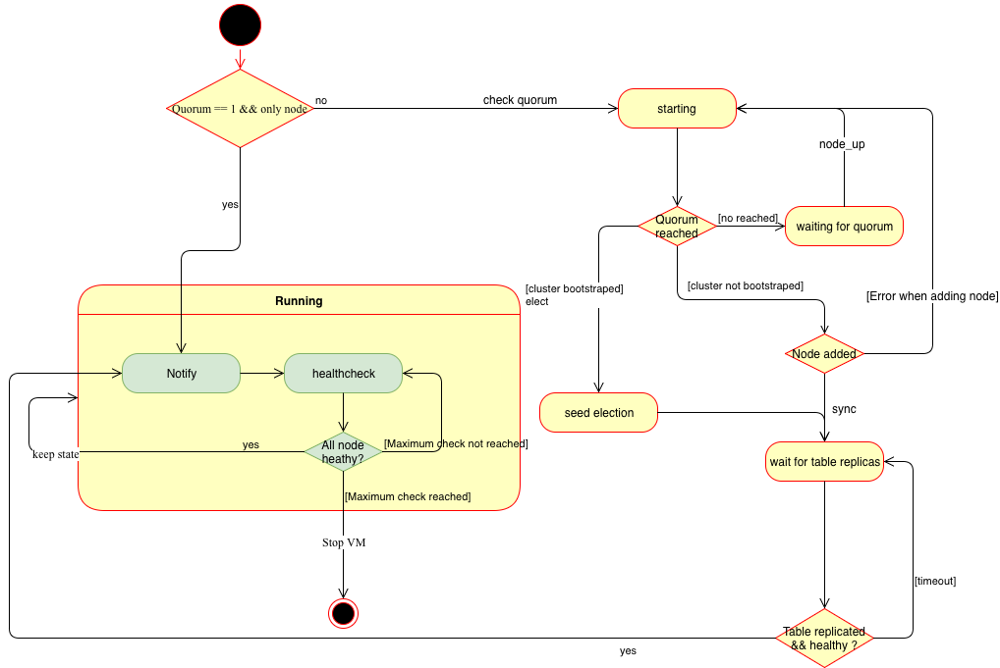

# DistributedRegistry

## History

**OTP** has a mechanism to register process inside a VM or inside a cluster, this is the `registry`.

**OTP** provide the `:global` registry that allow us to call processes accross the cluster.

The downside of `:global` is it's not really flexible and can have deadlocks/timeout during the synchronisation (but it's good enough for fiew processes).

We found `Swarm` a distributed regsitry which looked good.
But at the end we have faced deadlocks during the synchronisation, `Swarm` was trying to synchronise all the processes but it couldn't do it and hang on this state.
So no call could be made and the all application crashed.

But luckily **OTP** has also `Mnesia` which is a distributed database build on top of `ETS`/`DETS`.

The only problem is that `Mnesia` was designed in 1996 and in that time, there was no cloud architecture, therefore `Mnesia` handle difficulty dynamic topologies.

To conclude, `DistributedRegistry` is a distributed registry for **Erlang**/**Elixir** build on top of `Mnesia` and `libcluster`.
`Mnesia` is used to store the regsitry data and `libcluster` is used to detect cluster topology changes.

## Supervision tree

```
                                                +-----------------+
                                                |                 |
                                                |                 |
                                                |   Application   |
                                                |                 |
                                                |                 |
                                                +--------+--------+
                                                         |
           +--------------------+------------------+-----+------------------+
           |                    |                  |                        |
           v                    v                  v                        v
+----------+--------+   +-------+--------+   +-----+---------+      +-------+----------+
|                   |   |                |   |               |      |                  |
| ClusterSupervisor |   | TaskSupervisor |   | GlobalMonitor |      | MnesiaSupervisor |
|                   |   |                |   |               |      |                  |
+-------------------+   +----------------+   +---------------+      +---------+--------+
                                                                              |
                                                                              v
                                                                     +--------+------------+
                                                                     |                     |
                                                                     v                     v
                                                              +------+---------+   +-------+-------+
                                                              |                |   |               |
                                                              | MnesiaRegistry |   | MnesiaCluster |
                                                              |                |   |               |
                                                              +----------------+   +---------------+
```

## State machine



## How it works

When the distributed registry application start, we check if the quorum is reached.
The application will not start and accept requests until the disitributed registry is up and running.
All application depending on `DistributedRegistry` will wait for the distributed registry to up and running.

_The quorum is the minimum of nodes required to bootstrap the cluster._

If we start the distributed registry with a quorum of **1**, we bootstrap `Mnesia` directly.

Otherwise we wait until enough node has joined the quorum.
When the quorum is reached, ie libcluster registered a number of node greater than the quorum, an election starts.
This election will return the node that will bootstrap Mnesia cluster.
Indeed, Mnesia cluster cannot be starter by all nodes at the same time.
It needs to be started by one node and other can then join the cluster.

To do so, we need to _elect_ a node that will act as a _leader_, create the table and add other nodes.

_`Mnesia` does not require a master-slave architecture, but this process ensures Mnesia cluster
bootstrap properly without errors due to multiple bootstraps on different nodes._

- If the `Mnesia` cluster is not bootstrapped (ie the number of nodes connected in `Mnesia` is equal or greater of the quorum):
  We start a process named Sauron. This process is responsible to add new nodes in Mnesia and remove them when they drop.
- If the `Mnesia` cluster is bootstrapped we simply add the current node to `Sauron`

Then wait for the table to be replicated across Mnesia cluster. Once done, the distributed registry is started.

**_`Sauron` is a `GenServer` started once in the cluster via `:global` and act as a cluster leader. It will create the `Mnesia` table, add the nodes and activate the `Mnesia` replication for the table.
`Sauron` is monitored so if a cluster goes down `Sauron` is restarted elsewhere within the cluster._**

## Registry

### Registering a process

- Lookup if the name which we want to register exists in `Mnesia`
  - If it does not exist
    - Add the entry (PID, name) into `Mnesia`
    - Monitor the PID to be able to unregister the name if the process stops.
  - If it does exist
    Check if the PID associated with the name is Mnesia is still alive.
    If it is alive we have a name conflict. If it is not alive, the process failed to unregister it.
    - If the PID is still running.
      - Do not register the process.
    - If it's not running
      - Add the entry (PID, name) into `Mnesia`
      - Monitor the PID to be able to unregister the name if the process stop.

### Process lookup

- Look up for the process in `Mnesia`
  - If the process is not found then return `:undefined`
  - If the process is found
    - Ensure that the assosiated PID is alive.
      - If it's alived return the PID
      - If it isn't remove the entry from `Mnesia` and return `:undefined`


## GlobalSupervisor

We need to start some process only once across the cluster, but we also need to restart this process in any node on the cluster if it crashes.
We cannot link it to a Supervisor directly because once the `:global` sync it will kill processes on other nodes in order to have only one copy
of the process. Killing them, will trigger the Supervisor and restart them. And we entered in a loop.

To avoid that, `GlobalSupervisor` will only start the process without linking it, but monitoring it instead.
`GlobalSupervisor` will always have the latest PID assosiated to this process. (even if the process is started on a remote node).

## Installation

If [available in Hex](https://hex.pm/docs/publish), the package can be installed
by adding `distributed_registry` to your list of dependencies in `mix.exs`:

```elixir
def deps do
  [
    {:distributed_registry, "~> 0.1.0"}
  ]
end
```
Also add `:distributed_registry` to the extra_applications.
This will allow the application to wait for the distributed registry to be up and running.

```elixir
  def application do
    [
      extra_applications: [:logger, :distributed_registry]
    ]
  end
```

